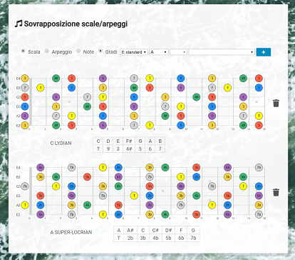

# Sovrapposizione scale/arpeggi

Tool che permette di affiancare verticalmente più tastiere di chitarra per lo studio delle sovrapposizioni delle scale/arpeggi. La visualizzazione della tastiera tramite d3.js è basata sulla preziosa libreria [fretboard](https://github.com/txels/fretboard). Per una demo seguire il [link](https://lorenzocorbella74.github.io/notes-on-fretboard/).

## Features
- [x] scelta di scale o arpeggi 
- [x] visualizzazione delle label delle note con nomi o gradi
- [x] Aggiungere modi della scala minore armonica e melodica
- [ ] responsive svg
- [ ] draggable item
## Built With

HTML5, CSS, Javascript, D3.js

## Versioning

Versione 0.0.1

## License

This project is licensed under the MIT License.
